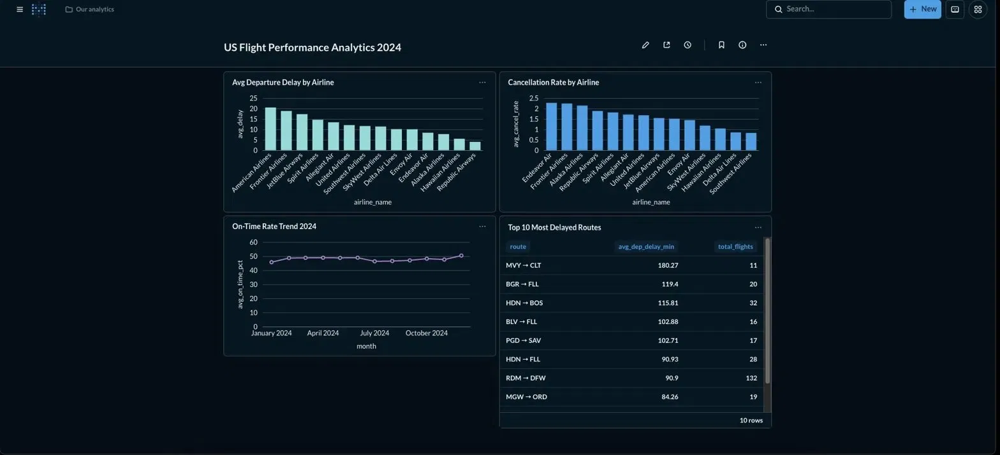
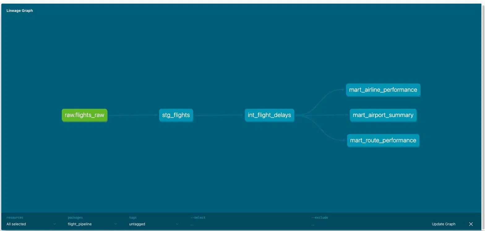

# ✈️ US Flight Delay ELT Pipeline

An end-to-end batch ELT pipeline ingesting **7M+ real 2024 US flight records** built with PostgreSQL, dbt, Apache Airflow, and Metabase — analyzing airline delay performance, route analytics, and airport operations across the entire US domestic network.

---

## 📊 Dashboard Preview



---

## 🏛️ Architecture

BTS Flight Data (7M+ rows, 2024)
↓
load_raw.py (Python + SQLAlchemy)
Chunked loading — 100K rows at a time
↓
PostgreSQL — raw.flights_raw
↓
┌─────────────────────────────┐
│         dbt Pipeline        │
│  staging → intermediate     │
│       → marts               │
└─────────────────────────────┘
↓
Metabase Dashboard
↑
Apache Airflow DAG
(6 tasks, monthly schedule)
---

## 🏗️ dbt Lineage Graph



---

## 🛠️ Tech Stack

| Layer | Tool | Purpose |
|-------|------|---------|
| Orchestration | Apache Airflow 2.8 | Schedule and automate pipeline |
| Database | PostgreSQL 15 | Store raw + transformed data |
| Transformation | dbt-core 1.8 | SQL models across 3 layers |
| Visualization | Metabase | Business intelligence dashboard |
| Containerization | Docker + Compose | Run PostgreSQL + Metabase locally |
| Language | Python 3.11 | Data loading + Airflow DAG |

---

## 📁 Project Structure
flight-pipeline/
├── airflow/
│   └── dags/
│       └── flight_pipeline.py    ← Airflow DAG (6 tasks)
├── dbt_project/
│   ├── models/
│   │   ├── staging/
│   │   │   └── stg_flights.sql   ← Clean + rename raw columns
│   │   ├── intermediate/
│   │   │   └── int_flight_delays.sql  ← Business logic layer
│   │   └── marts/
│   │       ├── mart_airline_performance.sql  ← Monthly airline KPIs
│   │       ├── mart_route_performance.sql    ← Route analytics
│   │       └── mart_airport_summary.sql      ← Airport operations
│   └── seeds/
│       └── airline_names.csv     ← Reference: codes → full names
├── scripts/
│   └── load_raw.py               ← Chunked CSV loader
├── docker-compose.yml
├── requirements.txt
└── README.md

---

## 📐 dbt Models

| Layer | Model | Output | Description |
|-------|-------|--------|-------------|
| Staging | `stg_flights` | View | Clean raw data, cast types, handle nulls |
| Intermediate | `int_flight_delays` | View | Classify delay status, route type, severity |
| Mart | `mart_airline_performance` | Table | Monthly KPIs per airline — delay, cancellation, on-time rate |
| Mart | `mart_route_performance` | Table | 6,490 origin→destination route analytics |
| Mart | `mart_airport_summary` | Table | 348 airports — operations, delays, cancellations |
| Seed | `airline_names` | Table | 15 airlines — codes to full names reference |

---

## 🔍 Business Questions Answered

- Which airlines have the worst average departure delay?
- Which routes are most likely to be cancelled?
- How does on-time performance change month over month?
- Which airports are the biggest operational bottlenecks?
- What is the difference in delay patterns between short, medium, and long haul routes?

---

## ⚙️ Airflow Pipeline

6 tasks running in sequence on a monthly schedule:
validate_csv_file → check_row_count → dbt_seed → dbt_run → dbt_test → dbt_generate_docs

| Task | Type | What it does |
|------|------|-------------|
| `validate_csv_file` | PythonOperator | Checks CSV exists and is readable |
| `check_row_count` | PythonOperator | Verifies >1000 rows loaded in DB |
| `dbt_seed` | BashOperator | Loads airline reference data |
| `dbt_run_all_models` | BashOperator | Builds all 5 dbt models |
| `dbt_test_all_models` | BashOperator | Runs 4 data quality tests |
| `dbt_generate_docs` | BashOperator | Generates lineage documentation |

---

## 🚀 How to Run Locally

### Prerequisites
- Docker Desktop
- Python 3.11 + Anaconda
- Kaggle account (for dataset download)

### Steps

**1. Clone the repo**
```bash
git clone https://github.com/nitishbhattad/flight-pipeline
cd flight-pipeline
```

**2. Start PostgreSQL + Metabase**
```bash
docker-compose up -d
```

**3. Create environment and install dependencies**
```bash
conda create -n flight-pipeline python=3.11 -y
conda activate flight-pipeline
pip install -r requirements.txt
```

**4. Download dataset**

Download `flight_data_2024.csv` from:
https://www.kaggle.com/datasets/hrishitpatil/flight-data-2024

Place it at `data/raw/flights_raw.csv`

**5. Load raw data into PostgreSQL**
```bash
python scripts/load_raw.py
```

**6. Run dbt models**
```bash
cd dbt_project
dbt seed
dbt run
dbt test
dbt docs serve   # view lineage graph at localhost:8080
```

**7. Start Airflow**
```bash
export AIRFLOW_HOME=./airflow
airflow standalone
# open localhost:8080 → trigger flight_data_pipeline DAG
```

**8. Open Metabase dashboard**

Open http://localhost:3000

---

## 📊 Key Findings (2024 US Domestic Flights)

- **American Airlines** had the highest average departure delay (~24 min)
- **Endeavor Air** had the highest cancellation rate among regional carriers
- **MVY → CLT** route had the worst average delay at 180 minutes
- On-time performance remained consistently around **50%** throughout 2024
- **348 airports** and **6,490 unique routes** analyzed

---

## 📝 Data Quality Tests

All dbt tests passing on 7M rows:

| Test | Column | Result |
|------|--------|--------|
| not_null | flight_date | ✅ PASS |
| not_null | airline_code | ✅ PASS |
| not_null | origin_airport | ✅ PASS |
| not_null | dest_airport | ✅ PASS |

---

## 👤 Author

**Nitish Bhattad**
MS Data Science — University of Massachusetts Dartmouth
[LinkedIn](https://linkedin.com/in/nitish-bhattad-457820150) | [GitHub](https://github.com/nitishbhattad)